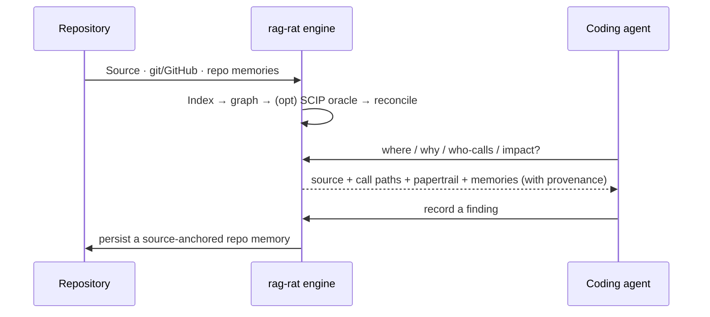

# rag-rat

[](https://github.com/cq27-dev/rag-rat/actions/workflows/ci.yml)
[](https://codecov.io/gh/cq27-dev/rag-rat)
[](https://crates.io/crates/rag-rat)
[](https://bencher.dev/perf/rag-rat/plots)

**What a repository knows about itself.** `rag-rat` is a local repo-intelligence index and MCP server
for coding agents. It keeps source files read-only, writes only its own SQLite database, and answers
with provenance on every result — current source, the code graph, git/GitHub history, and durable,
source-anchored repo memories that persist across sessions and agents.

Every harness already has `grep` and read. rag-rat is the layer they can't be: it carries the
*rationale* — the invariants, decisions, and risks bound to the code you're touching — and labels
every hit with confidence and coverage so you can judge it instead of trusting it.



## Why

- **Provenance, not guesses.** Every result carries a confidence label, coverage warnings, and the
  raw evidence — so a partial index or an ambiguous edge reads as exactly that.
- **Repo memories.** Typed, source-anchored notes (`Invariant`, `Decision`, `Risk`, …) that survive
  refactors and surface automatically during future queries — the signal grep can't give you.
- **A real code graph.** tree-sitter callers/callees/imports across Rust, TypeScript/TSX, Kotlin,
  C/C++, and Python — with an optional [compiler-grade SCIP oracle](docs/oracle.md) that upgrades
  edges to `Compiler` confidence and ranks the load-bearing symbols.
- **History as evidence.** Git history, lazy chunk blame, and cached GitHub issue/PR/review
  rationale, all queryable.
- **Rides your existing grep.** A [PreToolUse hook](docs/grep-augmentation.md) injects the memories
  and symbols behind whatever you just searched for.

## Install

```bash
cargo install rag-rat              # from crates.io (FastEmbed included by default)
```

From a checkout:

```bash
cargo install --path crates/rag-rat-cli --bin rag-rat
```

Add `--no-default-features` for a smaller hash-only build without real embeddings. SQLite is bundled
(compiled in via `rusqlite`), so there is no system-library prerequisite — see
[Platform support](#platform-support) for the per-OS C-toolchain note.

## Platform support

rag-rat builds and tests on Linux, macOS, and Windows. Linux is covered on every PR and on every
push to main; macOS and Windows are exercised on release, so `cargo install rag-rat` builds and
links on all three.
SQLite is bundled (compiled from source via `rusqlite`), so there's no system-library prerequisite,
but each platform needs a C toolchain: Linux ships one; on macOS install the Xcode Command Line
Tools (`xcode-select --install`); on Windows install the Visual Studio Build Tools with the C++
workload (MSVC). Requires **Rust 1.95+** (the bundled SQLite build uses the `cfg_select!` macro,
stabilized in 1.95).

A few maintenance conveniences are Unix- or Linux-only by design and degrade quietly elsewhere — no
feature of the index, query, or MCP surface is affected:

- **Hot-upgrade of a running MCP server** (the `SIGUSR1` in-place re-exec) is Unix-only. On Windows,
  restart `rag-rat mcp` to pick up a new binary.
- **Fleet auto-upgrade** (signalling other running servers when a new binary lands) is Linux-only —
  it walks `/proc` — and is a no-op elsewhere.
- **The grep-augmentation hook** uses a warm Unix-socket listener (with per-session dedupe) on
  Linux and macOS; on Windows it falls back to a per-call read-only query straight against the
  index, which works the same but without cross-call dedupe.

## Quickstart

From the repository you want to index:

```bash
cd /path/to/your/repo
rag-rat init
```

`init` scans the repo, prompts for languages and path bindings, writes `rag-rat.toml`, indexes,
offers to install the local embedding model, and can register the MCP server and git hooks. Preview
without writing anything with `rag-rat init --dry-run`; `--yes` runs the non-interactive defaults.

Manual setup and every config knob live in [`docs/config.md`](docs/config.md).

## Connect it to your agent (MCP)

The MCP server is STDIO — the client launches `rag-rat` as a child process. **`rag-rat init` is the
recommended path:** it registers the server **per project** (`claude mcp add --scope project` /
`codex mcp add`), so each repo gets its own index.

To wire it up by hand, register a **project-scoped** server that runs in the repo directory:

```bash
claude mcp add --scope project rag-rat -- rag-rat mcp
```

or a project `.mcp.json` / equivalent:

```json
{
  "mcpServers": {
    "rag-rat": { "command": "rag-rat", "args": ["mcp"] }
  }
}
```

> **Don't pin a single global server to one repo's config.** A user-scoped server with a hardcoded
> `--config /some/repo/rag-rat.toml` serves *that* repo's index and memories everywhere — so browsing
> a different codebase loads the wrong context. Register the server per project and let it resolve
> `rag-rat.toml` from the repo it runs in. (`--config <path>` still exists for the rare case you need
> to point at a specific profile.)

Pass `rag-rat mcp --json` if your client must parse tool text as JSON (results are
[TOON](#output) by default). Full tool schemas: [`docs/mcp-tools.md`](docs/mcp-tools.md).

## The tools

The highest-leverage ones (full catalog + JSON schemas in [`docs/mcp-tools.md`](docs/mcp-tools.md)):

- **`semantic_search`** — hybrid BM25 + vector recall over source/docs, validated against current
  source. Every hit reports `retrieval_mode`; `explain=true` breaks down the score.
- **`symbol_lookup`** — exact/fuzzy symbol resolution; cfg/overload duplicates grouped as one
  logical symbol.
- **`find_callers` / `trace_callees`** — reverse/forward graph traversal (low-signal std/macro noise
  filtered by default).
- **`impact_surface`** — the coding preflight: callers, callees, tests, git history, GitHub
  papertrail, and repo memories for a symbol in one call. `repo_memories` defaults to a compact,
  scannable per-memory header (kind, title, confidence, anchor status, and where it's bound); pass
  `full_memories: true` (or use `memory_for_symbol|path|call_path`) for the full bodies + bindings.
- **`important_symbols`** — load-bearing symbols by (SCIP-aware) PageRank; see
  [`docs/oracle.md`](docs/oracle.md).
- **`repo_brief` / `repo_clusters`** — orientation: spine / churn / god-modules / ownership clusters.
- **`read_chunk`** — current text for a chunk with anchor validation.
- Git/GitHub: `commit_search`, `git_history_for_path|symbol`, `git_blame_chunk`,
  `papertrail_for_*`, `rationale_search`.
- Memories: `memory_create`, `memory_update`, `memory_search`, `memory_for_symbol|path|call_path`,
  `memory_validate`, `memory_mark_obsolete`.

## Repo memories

Repo memories are first-class local evidence — not chat memory. They are typed
(`Invariant`, `Decision`, `RejectedAlternative`, `Risk`, `BugPattern`, `PerformanceNote`, …) and
**source-anchored**: bound to a logical symbol, concrete symbol, chunk, path+span, graph edge,
call-path, commit, or GitHub ref. rag-rat tracks each anchor as `current`, `relocated`, `stale`,
`gone`, or `unverified`, and surfaces matching memories through the `memory_*` tools and inline in
`read_chunk`, `symbol_lookup`, `find_callers`, `trace_callees`, and `impact_surface`. They're how
hard-won context reaches the *next* agent in one call instead of evaporating.

## Compiler-grade resolution & ranking

The graph is heuristic by default. The opt-in **SCIP oracle** (`rag-rat oracle run`) upgrades edges
to a `Compiler` tier from a real language tool, recovers calls tree-sitter missed, flags external
edges, and makes `important_symbols` surface the genuine god-modules. Turn on `[oracle] auto_run` and
the MCP server keeps it fresh on its own (throttled, watcher-safe). Full details:
[`docs/oracle.md`](docs/oracle.md).

## Freshness

`rag-rat mcp` runs a background file watcher (on by default; `[watch] enabled = false` or
`RAG_RAT_NO_WATCH=1` to disable), so graph/symbol queries reflect uncommitted edits without a commit.
Indexed rows are git-context-aware: clean files are stored by `commit_sha`, dirty/untracked files in
a worktree overlay, so one database reuses rows across branch switches while reflecting local edits.
Optional git hooks (`rag-rat hooks install`) keep the index current on checkout/merge/rewrite/commit.
`read_chunk` and search validate hits against current source and heal stale entries before returning.

One watcher per worktree and one writer at a time are enforced with file locks (unreliable on
NFS / WSL2 `/mnt` mounts).

## <a id="output"></a>Output format

The CLI and MCP results default to **TOON** (Token-Oriented Object Notation) — a token-efficient
encoding that renders uniform rows as a dense `[N]{cols}:` table (~30% smaller than compact JSON on
those payloads, never larger in practice). Pass `--json` (CLI, either position) or launch
`rag-rat mcp --json` (MCP) when a JSON parser must read the output.

## Commands

```bash
rag-rat init                       # guided first-run setup
rag-rat index [--changed|--discover|--full]
rag-rat doctor
rag-rat query "semantic recall"    # add --json for JSON
rag-rat important-symbols --limit 20
rag-rat brief --mode spine|churn|god_modules|refactor_candidates
rag-rat clusters --limit 10
rag-rat oracle run | status        # compiler-grade resolution (docs/oracle.md)
rag-rat models list | install <model>
rag-rat reconcile --changed-first --max-seconds 60 --batch-size 64
rag-rat github sync --from-refs
rag-rat hooks install              # git maintenance hooks
rag-rat gc                         # prune rows for dead git contexts
rag-rat eval [--json|--update-baseline]   # CI search-quality gate; requires a `--features eval` build (absent from the released binary)
rag-rat mcp                        # start the STDIO server
```

## Benchmarks

The headline workload is indexing the whole Linux kernel (v7.0, ~63k C/H files, 11.2M graph edges).
Full numbers — wall-clock, throughput, peak RSS, on-disk size, unresolved-edge taxonomy — are in
[`docs/benchmarks.md`](docs/benchmarks.md). Performance is tracked per-push and gated per-PR; the live
history is at [bencher.dev/perf/rag-rat/plots](https://bencher.dev/perf/rag-rat/plots) (wiring:
[`docs/bencher.md`](docs/bencher.md)).

## Security

The MCP server exposes read-only source tools. It never executes shell commands or writes your source
files. It writes only the configured SQLite index — during indexing, migration, maintenance,
reconciliation, repo-memory operations, and automatic stale-index healing. GitHub sync is explicit
and uses `gh api`; normal query tools read only the local cache.

## Releasing & license

Releases are automated by [release-plz](https://release-plz.dev) (the three crates ship in lockstep;
see [`docs/releasing.md`](docs/releasing.md)). `rag-rat` is MIT-licensed — see [LICENSE](LICENSE).

## Prior art

rag-rat's clone-detection design is inspired by SourcererCC's scalable token-bag candidate
generation, NiCad's normalized near-miss clone-detection framing, GumTree's move-aware AST
differencing, and anti-unification / least-general generalization for template extraction. Planned
fragment-level mining and copy-paste bug heuristics are inspired by CP-Miner.
