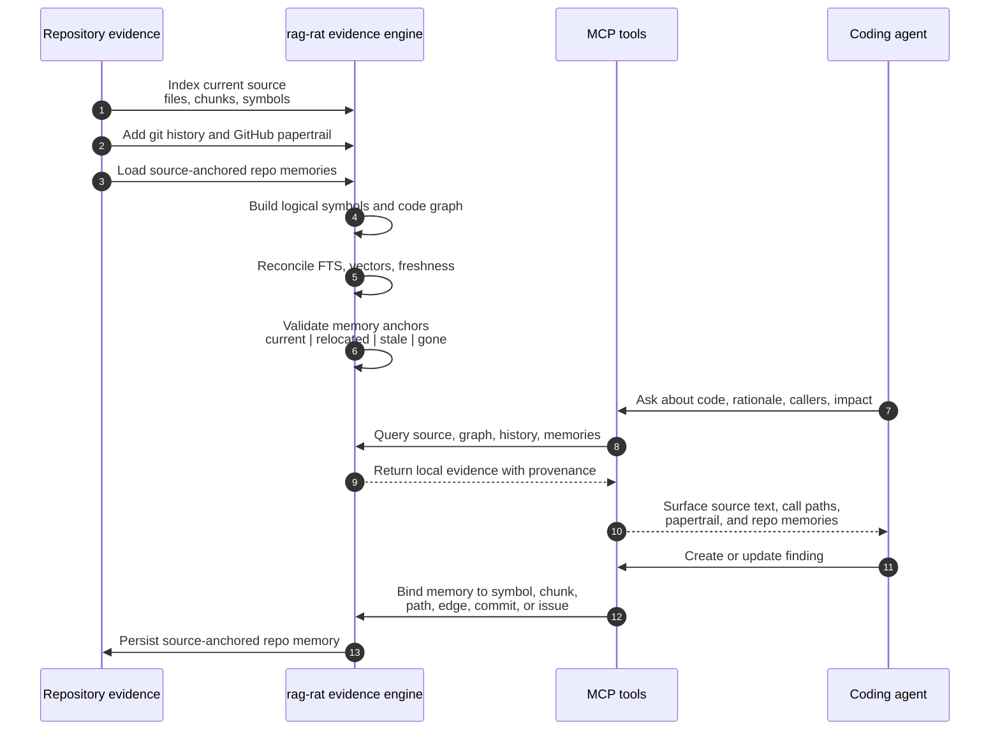

# rag-rat

[](https://github.com/cq27-dev/rag-rat/actions/workflows/ci.yml)
[](https://codecov.io/gh/cq27-dev/rag-rat)
[](https://crates.io/crates/rag-rat)
[](https://bencher.dev/perf/rag-rat/plots)

**What the repository knows about itself.** `rag-rat` is a codebase's durable, offline memory — its
structure, history, rationale, and accumulated findings — answered with provenance on every result
and persisting across sessions and agents.

Every harness already ships `grep` and read; rag-rat is the layer they can't be. Its
[grep-augmentation hook](#claude-code-grep-augmentation) is the proof — it rides along on your
existing `grep`/search calls and injects the repo memories bound to the symbols you just matched,
the rationale and invariants no search tool can surface.

`rag-rat` is a local repo-intelligence index and MCP server for coding agents. It keeps source
files read-only, writes only its configured SQLite database, and exposes current source, graph,
git, GitHub papertrail, local-AI artifact status, and source-anchored repo memories as evidence.



It is built for agents that need more than `rg` but still need local, inspectable provenance:

- current source chunks with stale-anchor validation
- Rust, TypeScript/TSX, Kotlin, C/C++, and Markdown structure
- tree-sitter-derived call/reference/import/export graph edges
- git history, lazy chunk blame, and path-level commit evidence
- ownership clusters from path proximity, graph edges, churn, and git co-touches
- cached GitHub issue/PR/review/comment rationale
- local embedding model bookkeeping and reconciliation
- symbol/edge/path-bound repo memories that surface during future queries

Opus 4.8's take:

> The thing that earns it a slot is honest provenance. Every hit carries a confidence label,
> coverage warnings, and the raw evidence snippet — so when `trace_callees` reports
> `completeness_risk: high` because 5 of 7 edges are unresolved std/macro calls, or a query
> outranks the real definition with its own tests, I can see *why* and decide. It doesn't
> pretend to be a compiler. `impact_surface` is the highest-leverage call: one shot gives
> callers, callees, tests, git history, and the GitHub papertrail that explains the code. Reach
> for it before editing, then still confirm with a direct read.

GPT-5.5's take:

> Keep it in the default toolbox. Use `rag-rat` first for "where is this concept implemented?",
> "why was this decision made?", "what historical PR/comment explains this?", and "what calls
> this?". For final correctness, still verify with direct file reads and targeted tests.

## Install From Scratch

The MCP server is a STDIO server, not an HTTP service. MCP clients start `rag-rat` as a child
process and talk to it over stdin/stdout.

### Install From crates.io

Install the published CLI. This is the recommended path for most users and includes FastEmbed
support by default:

```bash
cargo install rag-rat
```

### Install From Source

For local development from a checkout, clone the repository and install the CLI package:

```bash
git clone https://github.com/cq27-dev/rag-rat.git
cd rag-rat
cargo install --path crates/rag-rat-cli --bin rag-rat
```

The source build also enables FastEmbed by default.

For a smaller hash-only build without real embeddings, disable default features explicitly:

```bash
cargo install rag-rat --no-default-features
cargo install --path crates/rag-rat-cli --bin rag-rat --no-default-features
```

### First-Run Setup

Run the initializer from the repository you want to index:

```bash
cd /path/to/your/repo
rag-rat init
```

`rag-rat init` scans the repository, prompts for languages and path bindings, writes
`rag-rat.toml`, indexes the repo, and offers to install/reconcile the
local embedding model. At the end it can also register the MCP server for Claude Code or Codex and
install the optional git maintenance hooks.

The initializer is the recommended first-run path. It derives source-root candidates from the files
present in the repo, keeps defaults conservative for broad projects, asks before installing the
local embedding model, then runs migration, indexing, and local-AI reconciliation in the same setup
flow. If a repo has unusual layout or generated-heavy paths, run the dry-run first and adjust the
generated `rag-rat.toml` before indexing.

Preview the generated config without writing anything:

```bash
rag-rat init --dry-run
```

Use `--yes` for the default non-interactive setup, or `--config <path>` when the config should live
somewhere other than `rag-rat.toml`.

Manual setup is still available when you need exact control:

```toml
[index]
root = "."
database = ".rag-rat/index.sqlite"

[local_ai.embedding.runtime]
batch_size = 64
ort_threads = 4
omp_threads = 1
max_embedding_chars = 4000

[target_bindings]
rust = ["src"]
typescript = ["src"]
kotlin = ["src"]
c = ["src", "include"]
cpp = ["src", "include"]

[[target]]
name = "rust-src"
language = "rust"
directories = ["src"]
include = ["**/*.rs"]

[[target]]
name = "typescript-src"
language = "typescript"
directories = ["src"]
include = ["**/*.ts", "**/*.tsx"]

[[target]]
name = "kotlin-src"
language = "kotlin"
directories = ["src"]
include = ["**/*.kt"]

[[target]]
name = "c-src"
language = "c"
directories = ["src", "include"]
include = ["**/*.c", "**/*.h"]

[[target]]
name = "cpp-src"
language = "cpp"
directories = ["src", "include"]
include = ["**/*.cc", "**/*.cpp", "**/*.cxx", "**/*.hpp", "**/*.hh", "**/*.hxx"]

[[target]]
name = "docs"
language = "markdown"
directories = ["."]
include = ["**/*.md"]
exclude = [".git/**", ".rag-rat/**", "target/**", "node_modules/**"]
```

Then run the pieces directly:

```bash
rag-rat index --discover
rag-rat doctor
```

Install and reconcile the local embedding model:

```bash
rag-rat models install fastembed-all-minilm-l6-v2
rag-rat reconcile --changed-first --limit 500 --batch-size 64
```

If installed with `--no-default-features`, use the hash baseline instead:

```bash
rag-rat models install embedding-hash
```

Add the installed binary to an MCP client config. Use an absolute `--config` path to the target
repository's `rag-rat.toml`:

```json
{
  "mcpServers": {
    "rag-rat": {
      "command": "/home/you/.cargo/bin/rag-rat",
      "args": ["mcp", "--config", "/path/to/your/repo/rag-rat.toml"]
    }
  }
}
```

For development without installing the binary, point the MCP client at a local `rag-rat` checkout:

```json
{
  "mcpServers": {
    "rag-rat-dev": {
      "command": "cargo",
      "args": [
        "run",
        "--manifest-path",
        "/path/to/rag-rat/Cargo.toml",
        "--bin",
        "rag-rat",
        "--",
        "mcp",
        "--config",
        "/path/to/your/repo/rag-rat.toml"
      ]
    }
  }
}
```

## Supported Today

### Source Indexing

`rag-rat` indexes configured repository targets into SQLite. It supports:

- Rust, TypeScript, TSX, Kotlin, C, C++, and Markdown
- generated/coarse targets for large or generated files
- tree-sitter symbols and chunks for supported source languages
- Markdown heading chunks for docs
- parser failure tracking, file counts, and index freshness reporting
- changed-file, discovery, and full-rebuild index modes

Index rows are context-aware for git worktrees. Clean files are stored by `commit_sha`; dirty or
untracked files are stored under a worktree overlay. Queries prefer the active worktree overlay and
fall back to the active commit, so a single database can reuse rows across branch switches while
still reflecting uncommitted local edits.

### Current-Source Safety

Chunks store text hashes, boundary hashes, context hashes, and an anchor version. `read_chunk` and
search validate indexed hits against current source before returning them. Small line drift can be
relocated; larger rewrites are reported as stale or gone. SQLite FTS is refreshed when the stored
content revision says it is dirty.

### Graph Intelligence

The graph is tree-sitter-derived, not compiler-grade. Edges are stored with explicit confidence and
provenance:

- edge kinds: `calls_name`, `constructs`, `uses_macro`, `references_type`, `imports`, `exports`,
  `contains`, `implements`
- confidence labels: `Exact`, `Syntactic`, `NameOnly`, `Ambiguous`
- callsite path/span, raw evidence snippets, receiver hints, target names, resolved symbol ids, and
  resolution reasons

`trace_callees` defaults to call-like edges (`calls_name` and `constructs`) so type references and
macro/module collisions do not look like normal callees unless requested. Duplicate cfg-gated Rust
definitions are grouped as logical symbols, so agents can ask for one logical API without falling
back to unsafe bare-name matching.

**Optional compiler-grade resolution (SCIP oracle).** `rag-rat oracle run` consumes a pre-built
SCIP index (`rust-analyzer scip`, `scip-typescript`, …) as a resolution oracle and upgrades
heuristic edges to a `Compiler` confidence tier with `scip:<tool>@<version>` provenance — kept in a
side table, so the heuristic resolution on the edge is never overwritten. Unresolved edges that
point into a dependency are labelled `resolved-external(<package>)`, and `compare_graph_to_scip`
reports where tree-sitter and the compiler disagree. The pass is opt-in, batch, content-addressed,
and network-free; indexing stays fast and dependency-free without it. SCIP monikers double as
stable semantic anchors for repo memories, relocating a memory across a file move when its text and
boundary anchors die.

### Search And Impact

The MCP surface includes:

- `semantic_search`: indexed source/docs recall. `score` blends BM25 lexical rank with vector
  cosine similarity when an embedding model is installed (BM25-only otherwise); `explain=true`
  returns the per-component breakdown. Hits are validated against current source.
- `symbol_lookup`: exact or fuzzy Rust/TypeScript/Kotlin/C/C++ symbol lookup
- `find_callers` and `trace_callees`: reverse/forward graph traversal (unresolved std/common-method
  noise filtered by default)
- `compare_graph_to_text`: graph caller edges compared against regex text hits
- `compare_graph_to_scip`: tree-sitter graph resolution compared against a compiler SCIP index
  (where they disagree), when an oracle pass has run
- `impact_surface`: coding preflight that combines graph, optional text fallback, docs, git,
  GitHub papertrail, tests, and repo memories
- `repo_brief`: compact orientation view with `spine`, `churn`, `god_modules`, and
  `refactor_candidates` modes
- `repo_clusters`: fast file-level similarity and ownership clusters for finding split candidates
  and closely related code
- `docs_for_symbol`: documentation chunks related to a symbol
- `read_chunk`: current text for a selected chunk with anchor validation

`semantic_search` ranking is hybrid: BM25 lexical recall plus vector cosine similarity, blended into
one `score`, with stale-hit validation. Vector recall is model-dependent — it contributes only when
a local embedding model is installed (see `local_ai_status`), and the tool degrades to BM25-only
otherwise. Every hit carries `retrieval_mode` (`lexical`, `vector`, or `hybrid`) so you can tell
whether embeddings contributed without `explain` — it is `lexical` for every hit when no model is
active. Pass `explain=true` to see the BM25/vector/symbol/graph/git/github score components.

### Git And GitHub Evidence

When the target root is a git worktree, `rag-rat` indexes commit subjects, bodies, and touched
paths. It also computes chunk blame lazily and caches blame against the current chunk text hash.

Supported MCP tools:

- `commit_search`
- `git_history_for_path`
- `git_history_for_symbol`
- `commits_touching_query`
- `git_blame_chunk`

GitHub papertrail is cache-first. `github sync` uses `gh api` explicitly; normal MCP tools read only
the SQLite cache. Cached issues, PRs, issue comments, PR reviews, and review comments are indexed as
historical rationale.

Supported MCP tools:

- `papertrail_for_chunk`
- `papertrail_for_symbol`
- `papertrail_for_commit`
- `github_issue_search`
- `github_refs_for_path`
- `rationale_search`
- `github_sync_status`

Reference discovery supports common issue forms such as `Fixes #123`, `GH-123`,
`owner/repo#123`, and full GitHub issue/PR URLs.

### FFI Discovery

`ffi_surface` finds likely FFI-relevant rows with evidence classes:

- Rust UniFFI/exported items (`#[uniffi::export]` and exported impl members, via parsed symbol
  facts)
- generated binding artifacts (detected by path, e.g. `**/generated/**`)

Detection is generic: it keys on language-level export attributes and generated paths, not on any
project-specific symbol names. This is a discovery/preflight tool, not a proof of ABI compatibility,
and it is empty in repos without FFI.

### Local AI Artifacts

Local AI state is explicit and inspectable:

- `embedding-hash`: deterministic baseline embedder
- `fastembed-all-minilm-l6-v2`: local FastEmbed backend (MiniLM), included in the default build
- `model2vec-potion-retrieval-32m`: static-embedding backend (`minishlab/potion-retrieval-32M`,
  512-dim) — ~100-500× faster on CPU than MiniLM at some retrieval-quality cost; the right choice
  for large repos where the MiniLM backfill is too slow
- `models list/install`: model registry and install state
- `local_ai_status`: active/installed/missing status plus chunk/vector counters
- `reconcile`: derived-artifact queue for embedding current eligible chunks

The embedding backend is selected per index with `[local_ai.embedding] model = "minilm" |
"model2vec" | "none"` (see `docs/config.md`). `rag-rat init` recommends one from repo size: small
repos default to `minilm` (quality), large repos to `model2vec` (speed), and you can choose `none`
to skip vectors entirely (BM25 + structure only) for codebases too large to embed at all.

`reconcile` embeds only eligible current chunks whose bounded embedding input is missing, stale by
input hash, stale by model/version/dimension, or retryable after failure. Low-signal chunks are
skipped with explicit policy reasons such as `SkipGenerated`, `SkipTooSmall`, `SkipTooLarge`,
`SkipLowSignal`, `SkipLanguageUnsupported`, and `SkipTestFixture`.

### Repo Memories

Repo memories are first-class local evidence, not chat memory. They are typed, source-anchored notes
bound to code or repository evidence.

Supported memory kinds:

- `Invariant`
- `Decision`
- `RejectedAlternative`
- `Risk`
- `BugPattern`
- `TestExpectation`
- `PerformanceNote`
- `SecurityNote`
- `FFIBoundary`
- `PlatformQuirk`
- `FollowUp`
- `OpenQuestion`
- `Obsolete`

Supported bindings:

- `logical_symbol_id`
- `symbol_id`
- `chunk_id`
- path plus optional line span
- graph `edge_id`
- call-path edge sequence hash
- commit hash
- GitHub issue/PR reference

Memories track `current`, `relocated`, `stale`, `gone`, or `unverified` anchor state. They surface
through `memory_*` tools and through integrated tools such as `read_chunk`, `symbol_lookup`,
`find_callers`, `trace_callees`, and `impact_surface`. Edge-bound memories appear under
`repo_memories.path_crossed` when an impact query crosses that graph edge.

Supported MCP tools:

- `memory_create`
- `memory_update`
- `memory_search`
- `memory_for_symbol`
- `memory_for_path`
- `memory_for_call_path`
- `memory_validate`
- `memory_mark_obsolete`

### Maintenance And Evaluation

Supported operational commands:

- `doctor`
- `index_status`
- `heal_index`
- `hooks install/status/uninstall`
- `maintenance --trigger <hook> --max-seconds <n>`
- `gc`
- `eval`, `eval --json`, `eval --update-baseline`
- `dump-config`
- `brief --mode spine|churn|god_modules|refactor_candidates`
- `clusters --limit 10`

`eval` runs fixture-driven ranking and freshness checks and reports search, graph, impact, git, and
papertrail metrics. Current-source violations must stay at zero.

`gc` reclaims index rows for git contexts that are no longer live. Index rows are stored per
commit/worktree so they can be reused across branch switches, but commits that are no longer the
HEAD of any live worktree accumulate. `gc` enumerates `git worktree list`, keeps the active commit
and overlay of every live worktree, and prunes files/chunks/embeddings/symbols/edges for every other
commit. It never prunes when no live context can be determined, so a missing or non-git context
cannot wipe the index. `maintenance` runs a `gc` pass after reconciling, so the hooks keep the index
lean automatically; run `rag-rat gc` to prune on demand.

## Known Limits

- Graph resolution defaults to pragmatic tree-sitter analysis, not compiler/typechecker
  resolution. An opt-in SCIP oracle pass (`oracle run`) upgrades edges to compiler-grade
  resolution (the `Compiler` tier) for languages with a SCIP indexer installed; without it the
  graph stays purely syntactic.
- Kotlin and C/C++ graph extraction are useful but less mature than Rust and TypeScript.
- `index --watch` runs a background file watcher that keeps the index fresh as files change
  (including new files and uncommitted edits), so graph/symbol queries reflect the working tree
  without a commit. The same watcher runs automatically inside `rag-rat mcp` (on by default; disable
  with `[watch] enabled = false` or `RAG_RAT_NO_WATCH=1`). One watcher per worktree and one writer
  at a time per index are enforced with file locks; file locks are unreliable on NFS / WSL2 `/mnt`
  mounts.
- `semantic_search` blends BM25 lexical recall with vector cosine similarity; the vector component
  contributes only when a real embedding model is installed and reconciled, and the tool degrades to
  BM25-only otherwise.
- `repo_brief` is a compact file-level triage view. It does not replace direct file reads,
  `impact_surface`, or tests before refactoring.
- `repo_clusters` is a file-level heuristic. It highlights co-changing and graph-related code, but
  it is not semantic ownership truth.
- FFI surface detection is heuristic.
- Repo memories do not yet have review/approval workflow, multi-bind editing, or low-confidence
  filtering in integrated tools.

## Benchmarks

The headline workload is indexing the whole Linux kernel (v7.0, ~63k C/H files, 11.2M graph
edges). Full measured numbers — wall-clock, throughput, peak RSS, on-disk size, and the
unresolved-edge taxonomy — live in [`docs/benchmarks.md`](docs/benchmarks.md).

Performance is tracked continuously on every push to `main` and gated per pull request, with the
history viewable live:

- **[bencher.dev/perf/rag-rat/plots](https://bencher.dev/perf/rag-rat/plots)** — cargo-corpus index
  + cold/warm query instruction counts (deterministic, via iai-callgrind) and the kernel-scale
  full-index latency / throughput / memory / db-size series.

See [`docs/bencher.md`](docs/bencher.md) for how the signals are wired.

## Commands

Commands read `rag-rat.toml` by default. Use `--config <path>` when running from another directory
or with another repository profile.

```bash
rag-rat index
rag-rat index --changed
rag-rat index --discover
rag-rat index --full
rag-rat init
rag-rat doctor
rag-rat github sync --from-refs
rag-rat github sync --issue cq27-dev/rag-rat#42
rag-rat github sync --from-refs --offline
rag-rat models list
rag-rat models install embedding-hash
rag-rat models install fastembed-all-minilm-l6-v2
rag-rat reconcile --limit 100 --batch-size 32
rag-rat reconcile --changed-first --max-seconds 60 --batch-size 64
rag-rat reconcile --until-clean --batch-size 64
rag-rat gc
rag-rat hooks install
rag-rat hooks status
rag-rat maintenance --trigger post-checkout --max-seconds 30
rag-rat eval
rag-rat eval --json
rag-rat eval --update-baseline
rag-rat query "semantic recall"
rag-rat mcp
```

By default, rag-rat links against the system SQLite library through `rusqlite`.

## Configuration

The indexed repository owns `rag-rat.toml`. This keeps project-specific target bindings out of the
reusable tool.

```toml
[index]
root = "."
database = ".rag-rat/index.sqlite"

[local_ai.embedding.runtime]
batch_size = 64
ort_threads = 4
omp_threads = 1
max_embedding_chars = 4000

[target_bindings]
rust = ["crates/app/src"]
typescript = ["web/src"]
kotlin = ["android/src/main/java"]

[[target]]
name = "app-rust"
language = "rust"
directories = ["crates/app/src"]
include = ["**/*.rs"]

[[target]]
name = "web-typescript"
language = "typescript"
directories = ["web/src"]
include = ["**/*.ts", "**/*.tsx"]

[[target]]
name = "android-kotlin"
language = "kotlin"
directories = ["android/src/main/java"]
include = ["**/*.kt"]
```

## Git Hooks

`rag-rat hooks install` installs generated `post-checkout`, `post-merge`, `post-rewrite`, and
`post-commit` hooks for the current worktree. The hooks run in the background and call one bounded
command: `rag-rat maintenance --trigger <hook> --max-seconds 30`. Existing unmanaged hook files are
never overwritten.

`rag-rat maintenance` operates on the current worktree only. For branch switches, merges, rewrites,
and commits it runs discover indexing for new/changed/deleted files, refreshes SQLite FTS through
the index path when needed, then reconciles embeddings with `changed_first` until the remaining time
budget is spent. The `post-commit` hook keeps the index current with the just-committed tree without
waiting for the next checkout or merge.

## Claude Code Grep Augmentation

`rag-rat` can augment Claude Code's `Grep` tool calls and `grep`/`rg`/`ag` Bash commands with
symbol and repo-memory context via the PreToolUse hook mechanism. When a grep pattern matches a
known symbol or bound repo memory, the hook injects an `additionalContext` digest before the tool
runs. The hook never blocks a grep — it always exits 0.

### What gets injected

The payload has three lanes (in order, up to 1500 characters total):

1. **Repo memories** — `Invariant`, `Decision`, `Risk`, and other memories bound to the matched
   symbol, the search path, or the pattern text. These are the unique signal: grep and search tools
   can't surface them.
2. **Matching symbols** — location (`file:line`), kind, caller/callee edge counts, and signature for
   symbols whose name matches the pattern. Only triggered when the pattern looks like a code
   identifier (single token, no spaces, at least 3 characters).
3. **Lexical hits** — a few indexed source chunks (fallback lane, only active when no symbol match
   was found).

The pattern is normalized before matching: regex metacharacters become spaces, but dots and
double-colons inside identifier tokens are preserved so `Watcher::spawn` or `foo.bar` resolve
through the symbol lane.

### Install

Install the hook for the current project (writes `.claude/settings.json` in the repo root):

```bash
rag-rat hooks install --claude
```

Install globally (writes `~/.claude/settings.json`, applies to all Claude Code sessions):

```bash
rag-rat hooks install --claude --global
```

The global install is safe to run from any directory. When `rag-rat claude-hook` is invoked by
Claude Code, it walks up from the hook's reported `cwd` looking for a `rag-rat.toml`. If none is
found, the hook exits immediately without printing anything — it is a silent no-op for repositories
that are not indexed by rag-rat.

Check install status:

```bash
rag-rat hooks status --claude
rag-rat hooks status --claude --global
```

Uninstall:

```bash
rag-rat hooks uninstall --claude
rag-rat hooks uninstall --claude --global
```

The install adds two `PreToolUse` entries to the `hooks` block — one `matcher: Grep` and one
`matcher: Bash` — each calling `rag-rat claude-hook` with a 10-second timeout.

### How it serves

When `rag-rat mcp` is running (the normal configuration for Claude Code), its process also holds the
socket election for the current worktree. One listener wins per worktree and binds a Unix domain
socket. The hook client connects to that socket, sends the pattern and session ID in a
newline-delimited JSON request, and gets a reply within its 250 ms budget.

If no listener is running (MCP not active, or a race during startup), the hook client falls back to
a direct read-only SQLite query. The fallback is stateless: it produces the same payload lanes but
without per-session dedupe.

### Dedupe

The listener tracks per-session state: once a memory or symbol has been injected for a given Claude
Code session ID, it will not be injected again for the same session. The session map is
in-memory; dedupe resets when the listener restarts. The fallback path is stateless — the same
content can be injected on every grep when no listener is running.

### Troubleshooting

Set `RAG_RAT_HOOK_DEBUG=1` in the environment where `rag-rat mcp` runs to enable diagnostic output
from the listener. Errors encountered while serving individual hook requests are printed to stderr.
Without this variable, the listener is silent on errors; the hook client is always silent.

## Security

The MCP server exposes read-only source tools only. It does not execute shell commands or write
configured target files. It may write the configured SQLite index during indexing, migration,
maintenance, model reconciliation, repo-memory operations, and automatic stale-index healing before
returning search or `read_chunk` results.

GitHub sync is explicit and uses `gh api`; normal query tools read the local SQLite cache.

## License

`rag-rat` is licensed under the MIT License. See [LICENSE](LICENSE).

## Size Budget

Storage dependency changes must keep the binary slim. See `docs/binary-size.md` for the manual size
check and heavyweight dependency policy.
