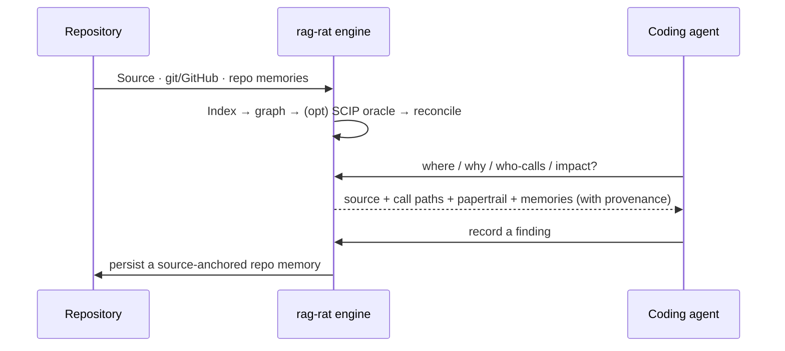

# rag-rat

[](https://github.com/cq27-dev/rag-rat/actions/workflows/ci.yml)
[](https://codecov.io/gh/cq27-dev/rag-rat)
[](https://crates.io/crates/rag-rat)
[](https://bencher.dev/perf/rag-rat/plots)

**What a repository knows about itself.** `rag-rat` is a local repo-intelligence index and MCP server
for coding agents. It keeps source files read-only, writes only its own SQLite database, and answers
with provenance on every result — current source, the code graph, git/GitHub history, and durable,
source-anchored repo memories that persist across sessions and agents.

Every coding harness already has `grep` and file reads. rag-rat adds the layer they do not provide:
source-anchored *rationale*. It connects the code an agent is about to touch to its callers, callees,
tests, git/GitHub history, prior decisions, invariants, risks, and duplicate-code signals — and
labels every result with confidence and coverage, so an agent can judge it instead of trusting it.



## Why

- **Provenance, not guesses.** Every result carries a confidence label, coverage warnings, and the
  raw evidence — so a partial index or an ambiguous edge reads as exactly that.
- **Repo memories.** Typed, source-anchored notes (`Invariant`, `Decision`, `Risk`, …) that survive
  refactors and surface automatically during future queries — the signal grep can't give you. They
  are *not* assistant memory: they are versioned, local, source-anchored facts about **this**
  repository that any future agent retrieves with evidence.
- **A real code graph.** tree-sitter callers/callees/imports across Rust, TypeScript/TSX, Kotlin,
  C/C++, and Python — with an optional [compiler-grade SCIP oracle](docs/oracle.md) that upgrades
  edges to `Compiler` confidence and ranks the load-bearing symbols.
- **History as evidence.** Git history, lazy chunk blame, and cached GitHub issue/PR/review
  rationale, all queryable.
- **Rides your existing grep.** A [PreToolUse hook](docs/grep-augmentation.md) injects the memories
  and symbols behind whatever you just searched for.
- **Flags clones as you write them.** A PreToolUse hook on Write/Edit/MultiEdit fingerprints the
  functions you're writing and warns when they're exact or near-duplicates of code already in the
  repo — so an agent reuses instead of re-implementing. Read-only, and a silent no-op when the index
  isn't ready, so it never blocks a write.

## Install

```bash
cargo install rag-rat              # from crates.io (FastEmbed included by default)
```

From a checkout:

```bash
cargo install --path crates/rag-rat-cli --bin rag-rat
```

Add `--no-default-features` for a smaller hash-only build without real embeddings. SQLite is bundled
(compiled in via `rusqlite`), so there is no system-library prerequisite — see
[Platform support](#platform-support) for the per-OS C-toolchain note.

## Quickstart

From the repository you want to index:

```bash
cd /path/to/your/repo
rag-rat init
```

`init` scans the repo, prompts for languages and path bindings, writes `rag-rat.toml`, indexes,
offers to install the local embedding model, and can register the MCP server and git hooks. Preview
without writing anything with `rag-rat init --dry-run`; `--yes` runs the non-interactive defaults.

Manual setup and every config knob live in [`docs/config.md`](docs/config.md). For a large repo where
the default local embedder is too slow, see [Embedding backends](#embedding-backends).

## Connect it to your agent (MCP)

The MCP server is STDIO — the client launches `rag-rat` as a child process. **`rag-rat init` is the
recommended path:** it registers the server **per project** (`claude mcp add --scope project` /
`codex mcp add`), so each repo gets its own index.

To wire it up by hand, register a **project-scoped** server that runs in the repo directory:

```bash
claude mcp add --scope project rag-rat -- rag-rat mcp
```

or a project `.mcp.json` / equivalent:

```json
{
  "mcpServers": {
    "rag-rat": { "command": "rag-rat", "args": ["mcp"] }
  }
}
```

> **Don't pin a single global server to one repo's config.** A user-scoped server with a hardcoded
> `--config /some/repo/rag-rat.toml` serves *that* repo's index and memories everywhere — so browsing
> a different codebase loads the wrong context. Register the server per project and let it resolve
> `rag-rat.toml` from the repo it runs in. (`--config <path>` still exists for the rare case you need
> to point at a specific profile.)

Pass `rag-rat mcp --json` if your client must parse tool text as JSON (results are
[TOON](#output) by default). Full tool schemas: [`docs/mcp-tools.md`](docs/mcp-tools.md).

## Try it

Right after `rag-rat init` the code graph, symbols, git history, semantic search, and clone
detection are ready — these answer on the first query. Repo memories start **empty**: they accrue as
agents record findings with `memory_create` and then surface automatically in later answers. (GitHub
issue/PR rationale needs a `rag-rat github sync`.)

Ask your MCP client:

- "Run `impact_surface` on the function I'm about to edit — its callers, callees, tests, and recent
  commits."
- "Where is config reload handled?" — hybrid `semantic_search` over source and docs.
- "What are the most load-bearing symbols in this repo?" — `important_symbols`.
- "Does this helper duplicate anything already in the codebase?" — `find_clones` (and the write-time
  hook warns as you write it).
- "Record an invariant on `parse_config`: reload must not allocate after the scheduler starts." —
  `memory_create` writes your first repo memory; it then rides along in future `impact_surface` /
  `symbol_lookup` results.

Or from the CLI:

```bash
rag-rat query "where is config reload handled?"
rag-rat important-symbols --limit 20
rag-rat brief --mode spine
rag-rat clusters --limit 10
```

## The agent loop

The point isn't the tool catalog — it's the loop an agent runs *around* an edit, so it changes code
with the callers, tests, rationale, and prior art in front of it instead of guessing:

1. **Before editing a symbol, ask `impact_surface`.** One call returns the current source anchor,
   callers and callees, related tests, git/GitHub rationale, the repo memories bound to that
   symbol / path / call-path, and confidence + coverage warnings.
2. **Read the blast radius, then edit.** The invariant a previous agent recorded, the caller three
   hops away, the test that pins the behavior — all surfaced before the change, not discovered after.
3. **The clone hook catches duplication at write time.** If the new function reimplements code that
   already exists, the Write/Edit hook says so, with the existing symbol to reuse.
4. **Record what you learned.** When the edit reveals a durable invariant, decision, or footgun,
   `memory_create` stores it as a source-anchored repo memory — so the next agent (or the next
   session) gets it in one call instead of re-deriving it.

A trimmed `impact_surface` answer (TOON — the default output; abbreviated here) — every field is
evidence, not prose:

```text
query:
  ref: "crates/config/src/config.rs::parse_config"
  resolution: syntactic
direct_semantic_callers[12]:
  - from_symbol: "crates/runtime/src/boot.rs::start"
    edge_kind: calls_name
    confidence: syntactic
    callsite:
      path: "crates/runtime/src/boot.rs"
      line: 88
    importance:
      label: local structural load
      score: 6.8
      bucket: high
tests_touching_symbol_path[4]:
  - path: "crates/config/src/config_tests.rs"
    reason: test_mentions_symbol_or_path
recent_commits_touching_symbol_path[1]:
  - evidence[1]: "a1b2c3d touched crates/config/src/config.rs: fix reload race during startup (#141)"
repo_memories:
  direct[2]:
    - kind: Invariant
      title: "Config reload must not allocate after the scheduler starts"
      confidence: high
      anchor_status: current
      binding_kind: symbol
    - kind: Decision
      title: "TOML over JSON5 for the config surface (#88)"
      anchor_status: current
      binding_kind: path
completeness_and_caveats:
  exact_graph_callers: 12
  memory_status:
    active: 2
    stale: 0
  caveats[1]: "Graph evidence is tree-sitter/syntactic, not compiler-grade name resolution."
```

And the write-time clone warning an agent sees before it duplicates logic — verbatim hook output:

```text
▶ rag-rat clone check — code you're writing duplicates existing functions:
  • `normalize_path_for_lookup` (line 42) is ~91% similar to crates/index/src/paths.rs::canonicalize_lookup_path
Prefer reusing the existing function(s) over duplicating — impact_surface / symbol_lookup to inspect them.
```

## The tools

rag-rat exposes **46 MCP tools** — the full catalog with JSON schemas lives in
[`docs/mcp-tools.md`](docs/mcp-tools.md). The ones you'll reach for most:

- **`impact_surface`** — the coding preflight from the loop above: callers, callees, tests, git
  history, GitHub papertrail, and the repo memories crossing a symbol, in one call. Memories default
  to compact, scannable headers; pass `full_memories: true` for full bodies + bindings.
- **`semantic_search`** — hybrid BM25 + vector recall over source and docs, validated against current
  source. Every hit reports `retrieval_mode`; `explain=true` breaks down the score.
- **`symbol_lookup`** — exact/fuzzy symbol resolution; cfg/overload variants grouped as one logical
  symbol.
- **`find_callers` / `trace_callees`** — reverse/forward call-graph traversal (low-signal std/macro
  noise filtered by default).
- **`important_symbols`** — the load-bearing symbols by (SCIP-aware) PageRank, seeded from your
  current diff by default; see [`docs/oracle.md`](docs/oracle.md).
- **`find_clones`** — exact + near-miss duplicate functions ranked by refactor ROI (the candidate
  graph is precomputed in the background, so it scales to large repos).
- **`memory_create`** — record a source-anchored repo memory; **`dream`** surfaces the maintenance
  worklist that keeps them honest ([below](#self-maintaining-memories)).

Beyond these: repo orientation (`repo_brief`, `repo_clusters`), git/GitHub rationale
(`commit_search`, `git_history_for_*`, `papertrail_for_*`, `rationale_search`), the full memory
graph (`memory_search`, `memory_edges`, `memory_rebind`, `memory_doctor`, …), graph-vs-compiler
audit (`compare_graph_to_scip`), and index diagnostics (`index_status`, `llm_status`, `heal_index`)
— all documented in [`docs/mcp-tools.md`](docs/mcp-tools.md).

## Repo memories

Repo memories are first-class local evidence — **not chat memory, not cloud personalization.** They
are versioned, local, source-anchored facts about this repository. Each is typed
(`Invariant`, `Decision`, `RejectedAlternative`, `Risk`, `BugPattern`, `PerformanceNote`, …) and
**source-anchored**: bound to a logical symbol, concrete symbol, chunk, path+span, graph edge,
call-path, commit, or GitHub ref. rag-rat tracks each anchor as `current`, `relocated`, `stale`,
`gone`, or `unverified`, and surfaces matching memories through the `memory_*` tools and inline in
`read_chunk`, `symbol_lookup`, `find_callers`, `trace_callees`, and `impact_surface`. They're how
hard-won context reaches the *next* agent in one call instead of evaporating.

Memories are also a **typed graph**, not just a flat list: `memory_edge_add` / `memory_edges` connect
them with relations (`depends_on`, `relates_to`, `supersedes`, `derived_from`, `tracks`) — a task DAG,
a mind-map link between decisions, or a task that `tracks` a GitHub issue. Full tool list:
[`docs/mcp-tools.md`](docs/mcp-tools.md#repo-memories).

## Self-maintaining memories

Memories rot: the code moves under them, an invariant gets superseded, a load-bearing function ships
with no memory at all. **`dream`** is the maintenance loop that keeps the layer honest. It recomputes
a ranked worklist of findings *about* the memories themselves — each with a stable id to review:

- **coverage gaps** — load-bearing symbols (by the same PageRank as `important_symbols`) that carry no
  memory, so the next agent editing them gets nothing.
- **stale references** — a memory citing a path or anchor that no longer resolves.

`dream` runs the deterministic findings on every call. Two opt-in **model passes** go deeper, running
a small model on an ephemeral remote GPU (`[llm.dream.remote]`) only when work is pending:
`rag-rat dream --verify` recomputes each memory's verdict against current source *reality* (has the
code drifted from what the memory claims?), and `--compact` rewrites a verbose memory to a tighter
summary. Findings those passes persist surface back through `dream`.

Nothing is deleted automatically. A human — or a strong agent over MCP — burns the worklist down with
**`dream_review`** (`accept` a real gap, `dismiss` noise, `reset` a prior verdict), and verdicts
survive future runs so settled findings don't come back. It's the same surface as the CLI
`rag-rat dream` / `rag-rat dream <id> --accept|--dismiss|--reset`.

## Compiler-grade resolution & ranking

The graph is heuristic by default. The opt-in **SCIP oracle** (`rag-rat oracle run`) upgrades edges
to a `Compiler` tier from a real language tool, recovers calls tree-sitter missed, flags external
edges, and makes `important_symbols` surface the genuine god-modules. For C/C++ the `scip-clang`
oracle distinguishes declarations from definitions and sharpens call/type edges in macro-heavy or
multi-target code — the difference between usable and noisy graphs on firmware, kernels, drivers, and
SDKs. Turn on `[oracle] auto_run` and the MCP server keeps it fresh on its own (throttled,
watcher-safe). Full details: [`docs/oracle.md`](docs/oracle.md).

## Freshness

`rag-rat mcp` runs a background file watcher (on by default; `[watch] enabled = false` or
`RAG_RAT_NO_WATCH=1` to disable), so graph/symbol queries reflect uncommitted edits without a commit.
Indexed rows are git-context-aware: clean files are stored by `commit_sha`, dirty/untracked files in
a worktree overlay, so one database reuses rows across branch switches while reflecting local edits.
Optional git hooks (`rag-rat hooks install`) keep the index current on checkout/merge/rewrite/commit.
`read_chunk` and search validate hits against current source and heal stale entries before returning.

One watcher per worktree and one writer at a time are enforced with file locks (unreliable on
NFS / WSL2 `/mnt` mounts).

By default every repo's index and memories live in **one consolidated database per machine**
(`$XDG_DATA_HOME/rag-rat/rag-rat.sqlite`; override with `RAG_RAT_DATA_DIR`), so a deleted checkout or
`git clean -fdx` no longer loses your authored memories. Set an explicit `[index] database` to keep a
repo on its own file (deprecated), and run `rag-rat consolidate` to import a pre-existing
`.rag-rat/index.sqlite` into the global store — see [docs/config.md](docs/config.md#database-location-index-database).

## <a id="output"></a>Output format

The CLI and MCP results default to **TOON** (Token-Oriented Object Notation) — a token-efficient
encoding that renders uniform rows as a dense `[N]{cols}:` table (~30% smaller than compact JSON on
those payloads, never larger in practice). Pass `--json` (CLI, either position) or launch
`rag-rat mcp --json` (MCP) when a JSON parser must read the output.

## Embedding backends

The default local embedder (FastEmbed) needs no setup, but a large repo or a stronger model is worth
offloading. rag-rat speaks the **OpenAI-compatible `/v1/embeddings` API**, so a `[llm.embedding.remote]`
block can serve embeddings from **Ollama, vLLM, or michaelfeil/infinity** — one client, one place to
audit and secure. Two modes:

- **Connect** to a server you already run (set `endpoint`).
- **Ephemeral** — let the bundled cookbook provision a GPU worker (**Modal / RunPod**) just for the
  backfill and tear it down afterward (set `cookbook`); pick the backend and GPU class in config.

The init flow warns when a **short-context model would truncate long code chunks** and steers you to a
long-context code embedder, and rag-rat **auto-tunes the client concurrency** against the chosen
backend so the sweep finds its throughput knee. Setup and every knob: [`docs/config.md`](docs/config.md).

## Retrieval quality

Search quality is measurable, not guesswork. rag-rat ships a **commit-replay evaluation harness**
(`rag-rat eval --replay`): each recent commit becomes a case — its message is the query, the files it
touched are the gold set — and search is scored on how well it recovers them. It reports **recall@3**
(did the right chunk land in the first three reads?), recall@10, and MRR@10, and CI tracks the trend
on [Bencher](https://bencher.dev/perf/rag-rat/plots) on `main` so a regression is caught before it
ships.

Reach for it when comparing embedding models, changing chunking, enabling int8 vector storage
(smaller on disk), or tuning a remote backend — you can prove the change didn't cost recall instead
of hoping. (`rag-rat eval` requires a `--features eval` build; it is absent from the released binary.)

## Benchmarks

The headline workload is indexing the whole Linux kernel (v7.0, ~63k C/H files, 11.2M graph edges).
Full numbers — wall-clock, throughput, peak RSS, on-disk size, unresolved-edge taxonomy — are in
[`docs/benchmarks.md`](docs/benchmarks.md). Performance is tracked per-push and gated per-PR; the live
history is at [bencher.dev/perf/rag-rat/plots](https://bencher.dev/perf/rag-rat/plots) (wiring:
[`docs/bencher.md`](docs/bencher.md)).

## Security

The MCP server exposes read-only source tools. It never executes shell commands or writes your source
files. It writes only the configured SQLite index — during indexing, migration, maintenance,
reconciliation, repo-memory operations, and automatic stale-index healing. GitHub sync is explicit
and uses `gh api`; normal query tools read only the local cache.

### Local vs remote embedding

With the **default local embedder, nothing leaves the machine** — indexing and querying are entirely
local. Configuring a `[llm.embedding.remote]` backend is what sends text off the box, in two places:
the **chunk text** selected at index time, and the **query text** of each semantic search (a search
embeds your query to compare it against the indexed vectors). A CONNECT backend embeds both against
the configured `endpoint`; an ephemeral backend embeds queries against the local `query_endpoint`.

What the endpoint *is* decides how much that matters:

- **Your own server** (self-hosted Ollama / vLLM / infinity) — the text stays in infrastructure you
  control.
- **Ephemeral Modal / RunPod workers** (the cookbook path) are ephemeral *compute* providers running
  *your* open-source embedder, not data services that train on inputs. Both are SOC 2 Type II, encrypt
  in transit and at rest, isolate tenants, and tear the box and its storage down after the backfill —
  a data-processor relationship, reasonable for proprietary code the same way a cloud VM is.
- **A third-party embedding API** you don't control is the one to actually read the terms on
  (retention, training on inputs).

Sensible hygiene regardless of backend: exclude secrets, generated files, and vendor trees from the
indexed targets so they're never chunked or embedded, and keep secrets out of query text. Details:
[`docs/config.md`](docs/config.md).

## Platform support

rag-rat builds and tests on Linux, macOS, and Windows. Linux is covered on every PR and on every
push to main; macOS and Windows are exercised on release, so `cargo install rag-rat` builds and
links on all three.
SQLite is bundled (compiled from source via `rusqlite`), so there's no system-library prerequisite,
but each platform needs a C toolchain: Linux ships one; on macOS install the Xcode Command Line
Tools (`xcode-select --install`); on Windows install the Visual Studio Build Tools with the C++
workload (MSVC). Requires **Rust 1.95+** (the bundled SQLite build uses the `cfg_select!` macro,
stabilized in 1.95).

A few maintenance conveniences are Unix- or Linux-only by design and degrade quietly elsewhere — no
feature of the index, query, or MCP surface is affected:

- **Hot-upgrade of a running MCP server** (the `SIGUSR1` in-place re-exec) is Unix-only. On Windows,
  restart `rag-rat mcp` to pick up a new binary.
- **Fleet auto-upgrade** (signalling other running servers when a new binary lands) is Linux-only —
  it walks `/proc` — and is a no-op elsewhere.
- **The grep-augmentation hook** uses a warm Unix-socket listener (with per-session dedupe) on
  Linux and macOS; on Windows it falls back to a per-call read-only query straight against the
  index, which works the same but without cross-call dedupe.

## Commands

```bash
rag-rat init                       # guided first-run setup
rag-rat index [--changed|--discover|--full]
rag-rat doctor
rag-rat query "semantic recall"    # add --json for JSON
rag-rat important-symbols --limit 20
rag-rat brief --mode spine|churn|god_modules|refactor_candidates
rag-rat clusters --limit 10
rag-rat oracle run | status        # compiler-grade resolution (docs/oracle.md)
rag-rat models list | install <model>
rag-rat reconcile --changed-first --max-seconds 60 --batch-size 64
rag-rat github sync --from-refs
rag-rat memory list | show <id> | doctor | rebind <id>    # inspect / re-anchor repo memories
rag-rat dream [--verify|--compact] [<id> --accept|--dismiss|--reset]   # memory-maintenance worklist
rag-rat consolidate                # import a legacy per-repo index into the global store
rag-rat hooks install              # git maintenance hooks
rag-rat gc                         # prune rows for dead git contexts
rag-rat eval [--json|--update-baseline]   # CI search-quality gate; requires a `--features eval` build (absent from the released binary)
rag-rat mcp                        # start the STDIO server
```

## Releasing & license

Releases are automated by [release-plz](https://release-plz.dev) (the three crates ship in lockstep;
see [`docs/releasing.md`](docs/releasing.md)). `rag-rat` is MIT-licensed — see [LICENSE](LICENSE).

## Prior art

rag-rat's clone-detection design is inspired by SourcererCC's scalable token-bag candidate
generation, NiCad's normalized near-miss clone-detection framing, GumTree's move-aware AST
differencing, and anti-unification / least-general generalization for template extraction. Planned
fragment-level mining and copy-paste bug heuristics are inspired by CP-Miner.
